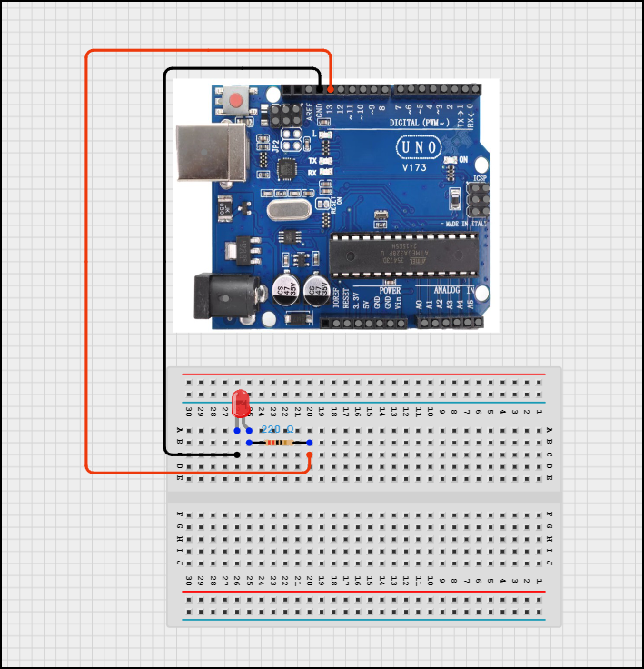

This is my most first and most basic project, utilising the <b>Arduino Uno R3</b>.

The functionality of this project is that every time the host sends a message (in the form of a singular byte) to the Arduino via Serial (9600 Baud),
The Uno will return each byte received via Serial and the LED will flash on and off once.

If multiple bytes are received, they will be returned iteratively between delays!

<h2>Wiring Diagram:</h2>
<ol>
    <li>Pin 13 -> 220 Ohm Resistor -> Led anode</li>
    <li>GND -> LED Cathode</li>
</ol>

